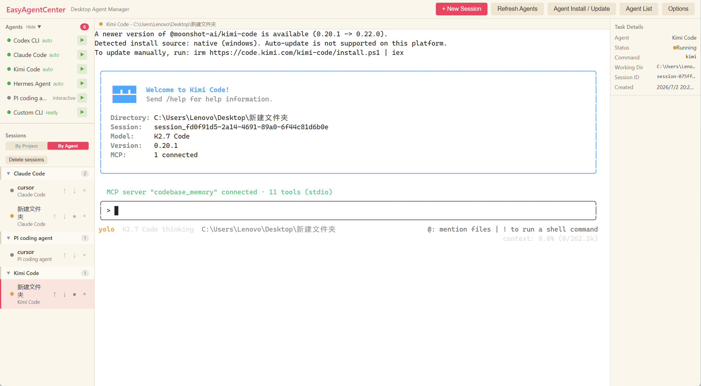
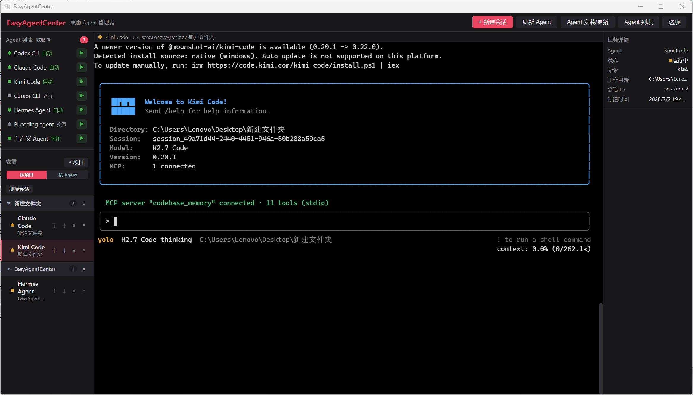

# EasyAgentCenter

[English](README.md) | [简体中文](README.zh-CN.md) | [Русский](README.ru.md) | [日本語](README.ja.md) | [한국어](README.ko.md) | [Español](README.es.md)

EasyAgentCenter는 Windows 데스크톱용 가벼운 CLI coding agent 관리자입니다.

EasyAgentCenter는 Codex CLI, Claude Code, Kimi Code, Hermes, 사용자 지정 CLI Agent를 한 창에 모아 프로젝트 기반 세션, 내장 PTY 터미널, 데스크톱 알림, Markdown 내보내기를 제공합니다.

여러 코딩 Agent를 동시에 사용하는 사용자에게 적합합니다. 프로젝트별 또는 Agent별로 세션을 확인하고, 내장 터미널에서 바로 대화하며, 프로젝트 디렉터리에서 빠르게 시작할 수 있습니다. 오른쪽 클릭 메뉴에서 세션을 다시 시작하거나 내보낼 수도 있습니다. EasyAgentCenter 자체에는 API Key가 포함되어 있지 않으며 세션 데이터를 업로드하지 않습니다. 각 Agent는 자신의 로그인 상태와 로컬 설정을 그대로 사용합니다.

## 스크린샷

<p>
  
  
</p>

## 주요 기능

- PATH에 설치된 CLI Agent 자동 검색.
- 프로젝트 폴더 추가 및 선택한 프로젝트에서 Agent 빠른 시작.
- 프로젝트별 또는 Agent별 세션 관리.
- 세션 기록 다시 시작, 중지, 삭제, 일괄 삭제, 순서 변경, 복원.
- 내장 PTY 터미널에서 Agent와 직접 대화.
- 세션 기록을 Markdown으로 내보내기.
- 터미널 배경색 사용자 지정.
- Codex CLI `/status`, `/usage` 출력을 보조하는 선택형 quota 패널.
- 알려진 Agent의 설치/업데이트 명령 안내.
- 세션 완료/실패 후 선택형 데스크톱 알림.
- UI 언어: 영어, 중국어 간체, 러시아어, 일본어, 한국어, 스페인어.

## Roadmap

- 더 세밀한 터미널 테마 및 레이아웃 사용자 지정.
- 워크플로 / 자동화 오케스트레이션 실험.

Roadmap 항목은 아이디어이며 약속이 아닙니다. 우선순위는 실제 사용과 피드백에 따라 달라집니다.

## 개인정보

EasyAgentCenter는 세션 메타데이터와 세션 로그를 사용자의 컴퓨터에 로컬로 저장합니다. 앱 자체는 세션 데이터를 업로드하지 않으며 API Key를 포함하지 않습니다. 개별 CLI Agent는 자체 로그인 상태, 환경 변수 또는 로컬 설정을 사용할 수 있습니다.

소스 코드에서 프로젝트를 실행하면 생성되는 `data/` 및 `logs/` 폴더는 로컬 개발용입니다. 이 폴더들은 Git에서 무시되며 저장소에 커밋하면 안 됩니다.

## 빠른 시작

### 개발 실행

```bash
npm ci
npm run dev
```

### 원클릭 개발 실행

더블 클릭:

```text
start-easy-agent-center.bat
```

명령 프롬프트 창을 숨기고 실행하려면:

```text
start-easy-agent-center-hidden.vbs
```

숨김 실행기는 `npm run dev`를 백그라운드에서 시작합니다. 시작 문제를 디버깅할 때는 보이는 `.bat` 파일을 사용하는 것이 좋습니다.

### 패키징

```bash
npm run dist:dir
```

압축 해제된 앱 실행:

```text
dist\win-unpacked\easy-agent-center.exe
```

포터블 exe:

```bash
npm run dist
```

## 요구 사항

- 일반 사용자는 포터블 exe를 다운로드하면 되며 Node.js가 필요하지 않습니다.
- 소스 개발에는 Node.js 24.14.0을 사용합니다. `.nvmrc` / `.node-version` 참조
- Windows가 주요 대상 플랫폼입니다

## 라이선스

[MIT](LICENSE)
